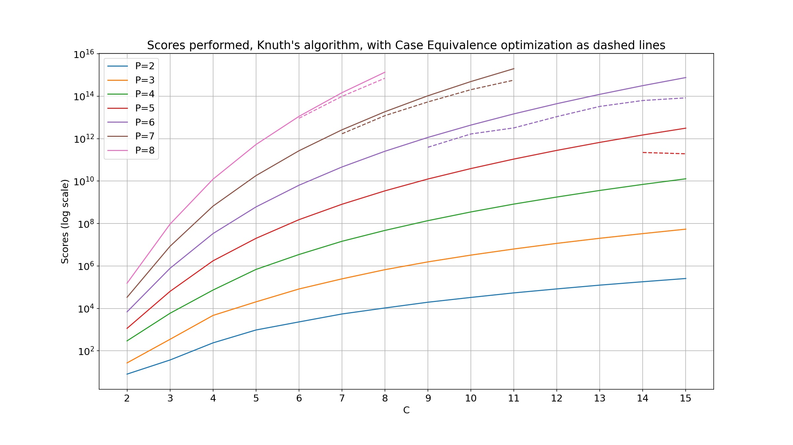
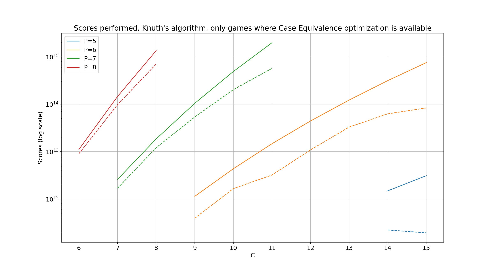

# Mastermind on the GPU

This is an algorithm to play all games of Mastermind on a GPU. All possible games are played at once, in parallel,
arranging per-game work and data effectively for the GPU. By doing so, we can also compute the next best guess for
(often large) groups of games just once, and we can further gather work across games into units that make the best
utilization of GPU resources. All game state is kept on-device, with minimal copying back to the host each round and
reduced synchronization overhead. Games are batched to improve scheduling and occupancy.

This document also outlines a CUDA implementation of the algorithm and discusses details and tradeoffs. This
implementation represents a significant speedup vs previous serial and GPU versions, allowing larger
games to be played in reasonable times.

Prior methods are adaptations of game-at-a-time approaches and use the GPU to accelerate the core scoring loop, or
attempt to play a single game at a time on the device. These methods have limited effectiveness, with high CPU and
host-to-device overhead, and make poor use of GPU resources per-game.

I've provided an optimized CUDA implementation, a simple reference CPU version, and a more optimized CPU version for
comparison. [Results are provided](/results/README.md) for many games up to 8 pins or 15 colors.

Multiple strategies are implemented: Knuth[^1], Expected Size[^2], Entropy[^2], and Most Parts[^3].

For a 7 pin 7 color game, using Knuth's algorithm, my previous best game-at-a-time CUDA algorithm executed in 24.3s.
The current algorithm executes in 14.2s.

# Prior Approaches

The core of most interesting Mastermind algorithms comes from the method described by Knuth in [1]. It involves scoring
all codewords, $AC$, against a diminishing set of possible solutions, $PS$, which splits them into subsets based on
their scores. The sizes of those subsets guide the selection of the next guess to play. For a game of $c$ colors and $p$
pins, there are $n = c^p$ codewords and thus $\mathcal{O}( n^2)$ scores computed for each guess played in a game.
Overall this is $\mathcal{O}(n^3)$ when playing all $n$ games, which is the focus of this paper.

Algorithms which play a single game at a time will play the next guess, reduce $PS$ by removing any codewords which
couldn't possibly be the solution anymore, select a new guess, and try again until the game is won. Memoization of
intermediate results significantly accelerates later games as the initial paths through the solution space are shared by
many games, and are the most expensive with large $PS$.[^4]

A reasonable first approach to solving Mastermind on the GPU is to move the most expensive portion of the CPU-based
algorithm into a GPU kernel, accelerating that portion, and then move more pieces as warranted. This can work quite
well, especially since finding the next guess is so extremely expensive and amenable to parallelism.

However, these approaches hit practical limits of memory bandwidth, both on-device and host-to-device, and work
scheduling as they are unable to effectively group work between games.

# Playing all games at once

When the same initial guess is played for all games (each with an unknown but unique secret), the resulting scores
partition the games into disjoint regions with a common property: all games within a region have the same reduced $PS$.
As such, all games in a region get the same next guess, and when that guess is played the region is further partitioned
into new, disjoint regions with the same property. This continues until each region reduces to a single game which is
then won. If each game is identified by its secret, then the list of games and $PS$ are initially the same, and each
region's games are the same as that region's $PS$.

Regions can be identified by the ordered sequence of scores which formed them, $R_i = (s_1, s_2, ... s_{d_i})$ where
$d_i$ is the depth of the final guess for that region. All games in a region share the same $PS$, so the next guess is
the same for them all.

Because every such region is disjoint from all others at a given depth, they may all be computed in parallel without
synchronization or regard to order. Regions of similar size, or with similar other properties, may be grouped and
dispatched to the GPU in any way that best exploits the nature of the device at hand.

## The algorithm

Regions are given an id $R_i$ that is the sequence of all scores which have created the region. Each id is initially
empty, and scores are appended with each turn until a winning score is added and the id is complete.

Identify each game $g$ by its secret. This provides a simple, convenient ordering and a good way to lookup region ids
and next guesses for a game.

1. Set $G = \\{g_0, g_1, ... g_n\\}$
2. Set the next guess for each game $N_g$ to the precomputed starting guess
3. Set the region id for every game $R_g = ()$
4. While there are games in $G$:
   1. Score a game's next guess $N_g$ and append that score to $R_g$
   2. Remove any game just won from $G$
   3. For each unique, un-won region $R$
      1. Using $PS = R$, compute a new guess $c$ for $R$
      2. Update $N_g = c$ for each game in $R$

This algorithm has a few important properties:

* Order in each step doesn't matter. For example, in step 4.i we can score games and build region ids in any order.
* Each step is parallelizable, with no shared state between games or regions within each step.
* We can order and group work by region size in a variety of different ways depending on how we want to use GPU
  resources.
  Other properties than region size may also be useful, though region size is a good way to pack the $n^2$ work onto the
  GPU.
* Almost all game state can be held on the GPU, which minimizes copies between host and device memory, and minimizes
  synchronization barriers.

Note that any algorithm can be applied in step 4.iii.a, such as those from Knuth[^1], Ville[^2], etc.

## Reference CPU Implementation

A simple, serial, CPU-only, C++ implementation of this algorithm is given
in [`solver_cpu_reference.in`l](https://github.com/mikemag/Mastermind/blob/178bebe5765c98d13e3053f8a9b5949a51c7fec3/solver_cpu_reference.inl#L37).
There are no optimizations, and it should be fairly readable and easily proved correct, if a little slow.

# Translation to CUDA

This is broken down into two phases. In Phase 1 we play a turn for all active games and organize the resulting regions,
and in Phase 2 we find new guesses to play on the next turn.

Note: this has been tailored for compute capability 8.6, CUDA 11.7, running on an NVIDIA GeForce RTX 3070. Other GPUs
might have capabilities which would suggest different tuning.

## Phase 1

Every game gets a stable index, which is the same as the index for its winning secret in $AC$. I.e., $G$ is $AC$. This is held
in a single device vector and game indexes are used in a variety of places.

There is a sequence of next moves per turn, $N_i$, to support a used codewords set, and for post-processing into per-game moves
and strategy output. Space for these are pre-allocated as device vectors, each the same size as $AC$, with the first one
pre-filled with the initial guess appropriate for the game configuration. Each $N_i$ is a parallel vector to $AC$.

There is a single device vector $R$ which holds a region id $R_i$ for each game, and the game's index in $AC$. This
allows us to reorder the regions after each turn and still reference quickly into $G$, $N_i$, etc. using the game's index.

The next move for each game is played and scored in parallel for all active games. There is no ordering requirement.
Region ids are updated with the new score.

$R$ is partitioned to bring active regions (games) to the front and push completed regions to the back. This
partitioning requires that the index of the last active region is returned to the CPU and is an early synchronization
barrier. The algorithm terminates when there are no active regions. All subsequent steps, and iterations for further
turns, operate on the reduced set of active regions only.

$R$ is sorted by id to bring the active regions together. This doesn't need to be stable. Game indexes are used
to break ties any time lexical ordering is required, and there are no ordering guarantees when splitting work across
blocks on the GPU.

Next, a list of start offsets and lengths for regions in $R$ is formed. This is a two-step
process. First, a `reduce_by_key` gets us run lengths, then an `exclusive_scan` builds start offsets. The reduction
returns the count of regions to the CPU, which is a second synchronization barrier.

If the case equivalence optimization is enabled, discussed below, we build the zero and free sets for every active
region with `buildZerosAndFrees`. The actual code is somewhat complicated, with a reduction fused with a few transforms
to build the zero set, a simpler transform to build the free set, and a zipped transform to combine the sets and adjust
free based on zero. The sets are represented by bit fields, each bit set representing a color present.

Next, $R$ is sorted by region length in order to facilitate better grouping by work size later. At this point the region
lengths are returned to the CPU for a third synchronization barrier, and a larger data transfer, though still small in
the grand scheme of things.

Finally, some pre-optimization is done to reduce indirection when finding new guesses. Region ids are translated to game
indexes and codewords for secrets.

This ends Phase 1. We now have a sorted, coalesced vector of regions, offsets and lengths into it, and other optimized
data prepared to help later. We have the number of regions and the lengths of the regions, in order, on the CPU.

This sounds like a lot of work, but it is insignificant compared to the time spent in Phase 2. As an example, for a
large game like 7p7c, the largest round spends 0.0075s in Phase 1 and 4.0350s in Phase 2. There are a number of obvious
optimization opportunities in the current version of the code, but given the trivial time spent vs. the extra complexity
I have chosen to ignore all of them.

## Phase 2

Next, we search for a new guess for every active region, and record those guesses in the $N_{i+1}$ vector to be played on
the next round.

We consider regions of size 1 and 2 "tiny", and these are all handled at once by a single kernel. This
kernel, `nextGuessTiny`, is a single block of 128 threads with each thread handling a tiny region in parallel. The
threads stride through these regions to request codewords in parallel and update $N_{i+1}$ with the trivially selected
next guess.

All other regions are considered "big" and handled the same. This includes seemingly tiny regions like size 3, and
regions no larger than the number of possible scores for a game (e.g., 14 for 4p games). I implemented a raft of
different optimizations and custom kernels for each of these cases and tested them all, and much like all of Phase 1 the
gains are insignificant vs. the work done on larger regions. Again, I've left them all out in favor of simplicity.

If the case equivalence optimization is enabled, discussed below, the big regions are sorted by Zero/Free colors. This
allows us to generate ACr for multiple regions at once and share them well. A fixed-sized ACr buffer is used to keep
memory bounded, and the buffer is filled eagerly.

All big regions are handled in chunks of 256 at a time.
A simple kernel `nextGuessForRegions` is launched which uses the region size to decide which kernels to use to search
for the best next guess. Only the regions which have an ACr generated are processed, and once those are done we iterate
and build more ACr, and keep going with the next group of big regions until they're all done.

The main kernel, `subsettingAlgosKernel`, is launched when no other optimization can be performed, and we must consider
every codeword in $AC$ as a possible next guess. This is launched with maximum parallelism and is specialized for GPU
occupancy based on the size of the region (and thus PS). See the discussion of subset sizes below for more details.

Each thread considers a single codeword from $AC$ (or $AC_r) and does the work to score it against every codeword in
$PS$ (aka $R_i$) to accumulate
subset sizes. The thread's codeword is given a rank based on the algorithm being run (Knuth, Most Parts, etc.), and that
rank is used by each thread block to reduce a single best guess for the block. Each block deposits the per-block best
guess into temporary global GPU memory, and a reduction kernel, `reduceBestGuess`, is used to reduce these to the single
best guess. This is written to $N_{i+1}$ in parallel by the reduction threads.

If the region size is less than or equal to the total number of possible scores then we have the opportunity to perform
the fully discriminating
optimization discussed below. The `fullyDiscriminatingOpt` kernel is launched for these regions with just 32 threads.
Each thread considers a single codeword from $PS$ and does the work to score it against every other codeword in $PS$,
computing the number of subsets. If a codeword is found which fully discriminates the possibilities in $PS$ then that is
used as the best guess and $N_{i+1}$ is updated appropriately. If no such codeword is found, it
launches `subsettingAlgosKernel`.

The chunks of big regions are stacked up into the same CUDA stream so that a fixed temporary space can be used for the
storage between `subsettingAlgosKernel` and `reduceBestGuess`.

Once all kernels are launched we synchronize for the last time this round, waiting for all next guesses to be computed.
We now have next guesses updated for all active games in the $N_{i+1}$ vector.

# Computing Subset Sizes

There are various well-known algorithms for playing Mastermind, and all the interesting ones are centered around
computing scores of one codeword vs every element of $PS$, and counting how many of each score is observed. This
effectively partitions $PS$ into subsets by score, and it's the sizes of these subsets that become interesting. Knuth's
algorithm[^1], for example, uses these to select the guess which minimizes the maximum number of codewords in each of 
$k$ subsets. 

The maximum number of scores per Ville(2013)[^2] is $p(p+3) \over 2$, plus 1 for inefficient packing (see below), which is 15 for 4p games,
and maxes out at 45 for 8p games.

That seemingly small number of counters quickly becomes large. Significant performance improvement comes from storing
these counters in shared GPU memory, even though the counters don't need to be shared between threads. Such memory is
typically limited to kilobytes per symmetric multiprocessor (SM), and on an NVidia RTX 3070 the default effective shared
memory size per thread block is 47KiB. With 32-bit counters, 45 subsets yields an upper limit of 267 threads. Rounded
down to the warp size of 32, it's a practical limit of 256 concurrent threads per SM, which is not enough to keep each
processor busy each cycle, resulting in suboptimal occupancy and thus GPU utilization. The result is blocks which are
ready to run, but cannot be scheduled only due to a lack of shared memory.

We need a counter for each possible score value which is large enough to count up to, at most, $|PS|$. For any reasonable
game, $PS$ is initially rather large and a 32bit counter is required. But $PS$ diminishes quickly and even large games
reduce $PS$ below 64k quickly, and a significant amount of work is spent on $PS$ smaller than 256.

Specializing the compute kernels with a properly sized counter type allows 2x or 4x the number of concurrent threads,
and yields significant improvement for these games.

We can pack counters for subset sizes tightly and index them directly with the score by using the packed scores
described in [Packed Indices for Mastermind Scores](Score_Ordinals.md). These score values cost a little more to
compute, but it's very minor. And these strange score values never escape the GPU, only being used to index into the
subset sizes, so it's okay that they're completely different from scores used elsewhere.

The Most Parts algorithm[^2] doesn't even need to compute subset sizes, only record usage of a subset, and thus a single
bit will do for all sizes of $PS$. These can be packed into a single 64bit word with no shared memory use, again using the
packed scores. The performance difference of this vs. 8-bit counters is insignificant, though, and the implementation
has been left out.

# Fully Discriminating Guesses Optimization

There is a good optimization due to Ville(2013)[^2]: if a codeword produces one subset for every member of $PS$ it is "fully
discriminating" and can be played right away. It will produce regions of a single codeword, and thus those games will be
won on the subsequent turn. This is only possible if $|PS| \leq$ the number of possible scores.

A separate kernel, `fullyDiscriminatingOpt`, is launched for such regions which is optimized for small sizes. If it
identifies a fully discriminating codeword, it is used as the next guess for the region, otherwise the larger subsetting
kernel is launched to perform a complete search.

A previous CPU implementation also looked for fully discriminating codewords in the full subsetting kernel, and
performed a simple reduction to select the lexically first such codeword and play that. This saved significant CPU time
each round, however in the current GPU implementation playing all games at once it turns out that the overhead to record
and reduce this is strictly slower than simply playing the result of the normal reduction. Multiple approaches were
tried, but in every case the extra overhead of the comparisons or the extra memory defeated the purpose. Thus, it has
been left out of the current implementation.

# Case Equivalence Optimization

Another good optimization due to Ville(2013)[^2] is to exploit case equivalence in codewords based on colors not yet
played (free colors) and colors which cannot possibly be part of the solution (zero colors). This can lead to a
significant reduction in $|AC|$ in many cases. The GPU and CPU implementations here are very similar, with the GPU
version focused on computing the sets efficiently for all regions on each round, and building $AC_r$ in parallel.

Currently, this optimization is only applied when $c^p > 400,000$. Games smaller than this complete in less than a
second, and in such fast games the extra overhead isn't really worth it. A fun comparison is the cutoff for
`SolverCPUFaster`: 256.

Also note that this is applied *after* the fully discriminating optimization described above. But, because it's not clear
ahead of time if the FD opt will apply, $AC_r$ is generated for each FD region even though it may not be used. This kept the
code simple, but is likely quite wasteful and an obvious point for improvement.

The work done to both compute the Zero and Free sets, and to build every necessary $AC_r$ sounds large, but in fact is
almost trivial vs the work to compute the next guess. I originally did it all in its own phase between 1 and 2 to
measure the extra time, but it honestly wasn't worth noting. Much like the work done in Phase 1, it is such a tiny
fraction of the real work needed that it's not worth measuring. It also parallelizes on a GPU easily.

While each $AC_r$ is much smaller than $AC$, there can be a large number of regions in play mid-game, and thus a large
number of $AC_r$ needed for those rounds. For games up to a few million codewords, all necessary $AC_r$ were able to
fit into device memory on a single 4090 w/ 24GB memory, but larger games exhausted the RAM on this system. Thus, a
fixed-sized buffer is used for the $AC_r$, and when it's full the big kernels are launched to consume them, then the
buffer is filled again, and we rinse and repeat until the round is done.

The pre-computed $AC_r$ sizes (see [Symmetry and Case Equivalence in Mastermind](Symmetry_and_Case_Equivalence.ipynb))
are used to determine how the sets can pack into the fixed buffer, so only a very small constant space is needed to
build each new set. A predicate which rejects codewords which are not class representatives is used to filter $AC$ into
$AC_r$ for any combination of Free and Zero colors. The sets are represented with bit fields, and we can determine if
a codeword is a class representative by exploiting the fact that we use the lexically first codeword as the
representative. See [isClassRepresentative](../codeword.inl).

The current implementation takes a fairly straightforward approach to completing big regions with their $AC_r$. They
are completed in order sorted by Zero/Free set, then region length. However, this is likely not optimal. The work
done is $|AC_r| * |PS|$ for each region, and that is essentially random given the current sorting. It's likely better
to batch regions based on total work schedulable instead, but this presents a challenge for sharing $AC_r$ and
generating each one only once. More experimentation is necessary.

It's also possible, if not likely, that this optimization isn't necessary for $PS$ of size 3, and maybe even 4 or 5.
Those experiments have also not yet been done.

Note that while pre-computed $AC_r$ sizes are used, they're not really necessary. They're quick to compute, but I
implemented them in Python first as part of my initial experiments, and I was just too lazy to re-do it in C++.

## Some Numbers

Possible $AC_r$ sizes can be seen in [ACReduced.json](../ACReduced.json), but it's useful to see the impact on
actual runs. After all, it's not readily apparent how many $AC_r$ will be produced for any given game, nor how
many games they impact in terms of scoring operations or time.

|   7p7c   | Time (s) |      Scores       |
|:--------:|:--------:|:-----------------:|
| Original |  3.5283  | 2,594,858,890,338 |
|  CE Opt  |  2.6222  | 1,688,549,605,473 |
| Speedup  |  1.35x   |       1.54x       | 

|   8p8c   | Time (s) |        Scores         |
|:--------:|:--------:|:---------------------:|
| Original |   955    | 1,346,760,512,102,540 |
|  CE Opt  |  1,974   |  701,717,829,399,382  |
| Speedup  |  2.07x   |         1.92x         | 

And here are log scale plots of the scores performed in all games to-date, with and without this optimization. 
Recall that the optimization is only enabled when $c^p > 400000$. 

# Scoring Function on the GPU

The scoring function used is based on the hand-vectorized version in [codeword.inl](../codeword.inl). The first portion,
computing $b$ with the constant operations on a single 32 bit value was kept unchanged. Happily, GPUs
provide `popcount`.

The second part, computing all hits based on color counts, changed a bit. GPUs provide data types which pack 8-bit
integers into vectors of 4 values, and automatically turn common operations on them like addition and minimum into
vector ops. Minimums of the pair of 16 color counts are taken with four such vector ops, then the minimums are reduced
with a series of a few vector additions.

This ends up being very efficient and, like the CPU version, far faster than any attempts to memoize results for reuse
later.

# Variable Sized Codewords

A codeword up to 8 pins is encoded in a single 32-bit value, with each pin up to 15 colors represented by 4 bits. Color
counts are pre-computed when forming the codewords and are encoded with 8 bits per count. For a 15 color game we need
120 bits, so it's encoded into a 128-bit value. However, half the games we wish to play have 8 or fewer colors, wasting
half of the color count memory.

The current implementation specializes the `Codeword` type based on game size, and uses 64-bit values for packed color
counts on smaller game sizes. This is a significant win in terms of memory not only because of the obvious savings of 8
bytes per codeword, but also due to alignment requirements on the type which resulted in much more waste. This yields
better coalescing of global memory requests, increased useful data with each request, etc.

Finally, by reducing the color counts by half the number of vector ops to compute all hits in the scoring function is
also reduced by half for an extra time savings.

# Processing Results

There are two interesting results from this algorithm. First, the number of guesses needed to win a game configuration,
average and maximum, and second the tree of guesses played and scores.

All of this is captured in the $R$ and $N$ vectors on the device. These are returned to the CPU after all work is done.
$R$ lets us compute the max turns required, and the average. $N$ allows us to build a strategy graph which shows what
sequence guesses to make for any game played.

There are other interesting stats as a byproduct of the implementation, e.g. number of scoring operations, time spent,
region counts at each level, etc. These are accumulated in device memory and extracted afterward as well.

[^1]: D.E. Knuth. The computer as Master Mind. Journal of Recreational Mathematics, 9(1):1–6, 1976.

[^2]: Geoffroy Ville, An Optimal Mastermind (4,7) Strategy and More Results in the Expected Case, March 2013, arXiv:
1305.1010 [cs.GT]. https://arxiv.org/abs/1305.1010

[^3]: Barteld Kooi, Yet another mastermind Strategy. International Computer Games Association Journal,
28(1):13–20, 2005. https://www.researchgate.net/publication/30485793_Yet_another_Mastermind_strategy

[^4]: My previous implementation which played games serially can be found on
the [`game_at_a_time` branch](https://github.com/mikemag/Mastermind/tree/game_at_a_time).
