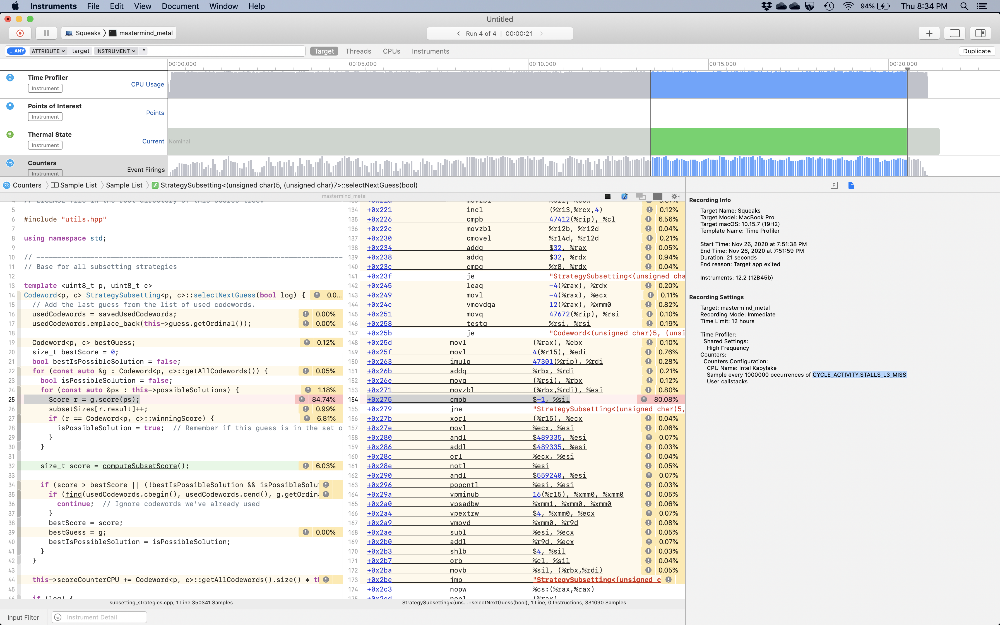
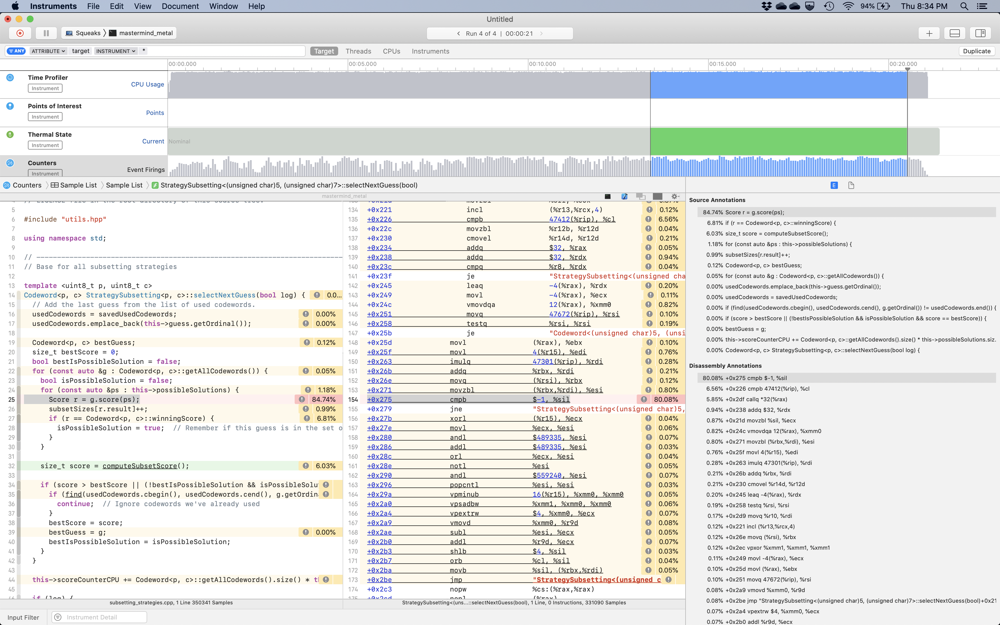

# Score Caching Considered Harmful

*[*with apologies to Edsger Dijkstra](https://en.wikipedia.org/wiki/Considered_harmful) ;)*

The number of codewords in a game of Mastermind with *p* pins and *c* colors is *c<sup> p</sup>*. The more interesting
gameplay algorithms require, at some point, scoring every codeword against a subset of possible codewords, which is
an inherently *O(n<sup> 2</sup>)* operation, repeated once for each turn in every game. For a even a *4p6c* game that's
up to 1,679,616 comparisons.  

So it's reasonable to consider ways to speed up scoring, and a common first approach is to simply cache or memoize
scores for pairs of codewords, eventually resulting in cached scores for all codewords. (Applying a true cache of a 
small, limited size is a poor choice for this problem.) Some may even choose to first compute scores for all pairs up front
then simply retrive them via table lookup during gameplay.

In fact, this was my first approach to speeding up my early Java versions. And it worked nicely. 

## Cache access patterns

The core of many of the gameplay algorithms goes something like this:

```
bestGuess = nil
for each codeword A in all possible codewords:
    clear setCounters
    for each codeword B in a somewhat random subset of all possible codewords:
      s = score(A, B)
      setCounters[s]++

    use setCounters to consider updating bestGuess to A
```

Consider a *n x n* matrix of scores for all pairs of codewords. This algorithm will iterate through a random set of 
rows each time it is called, decreasing the size of the subset used in the inner loop each turn until a game is won.
This drags these rows through the processor's cache hierarchy as they're pulled in from main memory only to be discarded
immediately in favor of new scores.

## How much memory are we talking about here?

Suppose we pack scores into a single byte with *s = (b << 4) | w*. The total number of codewords is *t = c<sup> p</sup>*.
Make the score cache a single dimension array of *t<sup> 2</sup>* bytes.
Give every codeword an ordinal starting at 0, and use these ordinals as indices into the array.
The score for two codewords *a* and *b* is `s = cache[a * t + b]`.

For even a relatively small game like 4p8c that's a 16MiB table, precisely the L3 cache size on my processor. And we need
other things in that cache, too. Going larger than that greatly exceeds L3 instantly: 4p9c is a 41MiB table and 5p6c is 57MiB.

It's easy to want to play games with multi-GiB score tables. It becomes easy to see how every iteration of the inner loop above
ends up going to main memory for every score.

Even so, how is loading values from main memory slower than a scoring function?

## Fast scoring functions

It's actually pretty easy to end up with a scoring function that is in fact faster computing a codeword score than
going to RAM for scores.

Consider the classic scoring algorithm shown by Knuth[1] given two codewords *a* and *b* of *p* pins and *c* colors.
Also include pre-computed color counts for each, called *cca* and *ccb* respectively:

```
all = 0
for i = 0..c:
  all += min(cca[i], ccb[i])

b = 0
for i = 0..p:
  if a[i] == b[i]: b++

s = (b << 4) | (all - b) 
```

The pin values and color counts for each of the *t* codewords can be reused over and over each iteration of the inner loop
of the gameplay algorithm above, and these easily fit in cache for larger games. Assume a 32bit codeword and 64bit color count,
that's just 91KiB for a 5p6c game instead of a 57MiB score table.

Executing even a fairly literal translation of this pseudocode into Java or C++ will yield a surprisingly fast scoring function.
In fact, you may find that a recent GCC or Clang compiler will auto-vectorize the loops and/or unroll them very effectively,
especially if you make *p* and *c* constants.
This ends up being a relatively small number of instructions executed completely in registers after a few loads from fairly warm
cache lines.

And it's very easy for this to end up faster, a lot faster, than going to memory for random rows of a score cache.

## Hard data

Using the score cache described so far, with the addition of lazily populating it, running a *5p7c* game using
Knuth's algorithm, CPU-only:

- With score cache: ~22s
- Without cache: ~3s

Yep, that's a very big difference.

System specs:

* MacBook Pro (16-inch, 2019)
* macOS Catalina 10.15.7
* Intel(R) Core(TM) i9-9980HK CPU @ 2.40GHz, 32kb L1 i & d cache, 256kb L2, 16mb L3
* 64 GB 2667 MHz DDR4
* Clang version 10.0.0
* Release build, -O3 -std=c++20 -march=native

### Profiling it

Profiling it with Instruments using the Time Profiler and Counters instruments showed the problem readily.
Just using the Time Profiler, which is a sampling CPU profiler on a fixed rate, over 80% of the time was
spent on the instruction performing the load from the cache.

Using Counters and capturing stacks on `CYCLE_ACTIVITY.STALLS_L3_MISS` we could see a steady stream of 
L3 misses once the algorithm was into it's steady state. The screen shots below show the profile narrowed
towards the end of the runs to highlight this.

Screen shot showing 80.08% samples spent waiting on L3 misses loading from the score cache along with the
settings for the Counters instrument:



Screen shot showing the same profile at the same point, but with hotspots shown which give a hint that
cache pollution by the score cache is wrecking our access to the `setCounters` array later as well.



## Conclusions

First and foremost, the importance of revisiting the cost/benefit analysis and remeasuring past optimizations
can't be understated. It's easy to put in an optimization, see a win, and then assume it's a win forever.

Second, any effort you put into improving the speed of your scoring function means you need to revisit other
optimizations and shortcuts each time you do it. It's easy to reach the point where your scoring function is
faster than your efforts to avoid calling it.

This result was similar for [my Java version](https://github.com/mikemag/CS-Education/tree/master/APCS/Mastermind),
though I didn't save any of my timing data.

I rolled with a score cache in my Java and C++ versions far longer than I'm proud to admit.
I've since removed it from both implementations completely, as the code clutter to have it as an option just
wasn't worth it to me anymore. 

My results should be easily reproducible in any Java or C++ implementation with a score cache, and it's not
too bad to go add it back into my implementations for further study if someone has an interesting 
variant I should explore.

## References

[1] D.E. Knuth. The computer as Master Mind. Journal of Recreational Mathematics, 9(1):1–6, 1976.
